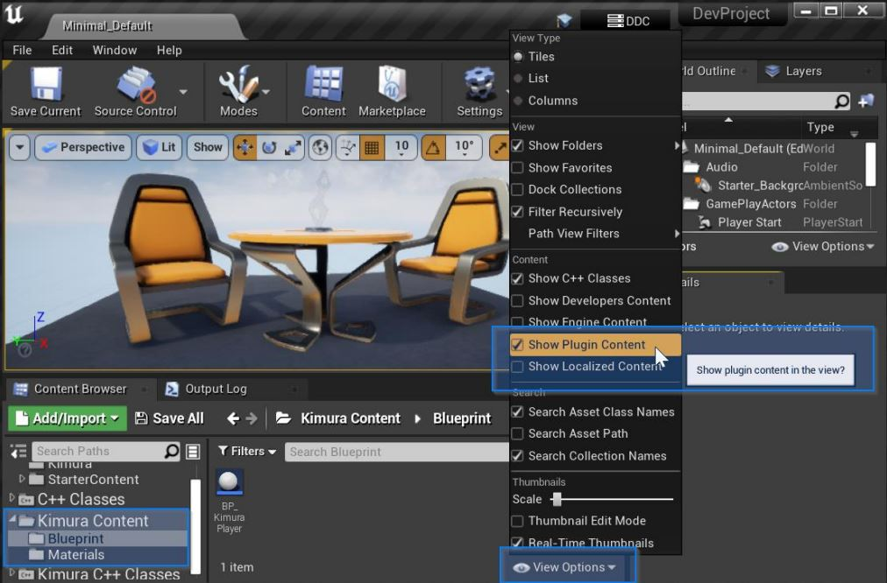
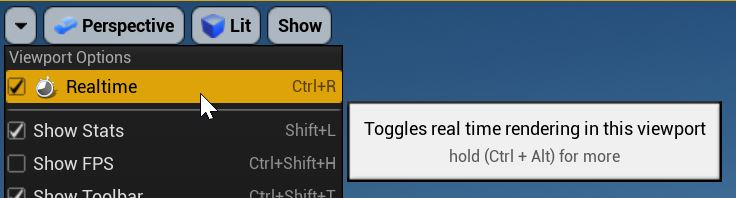
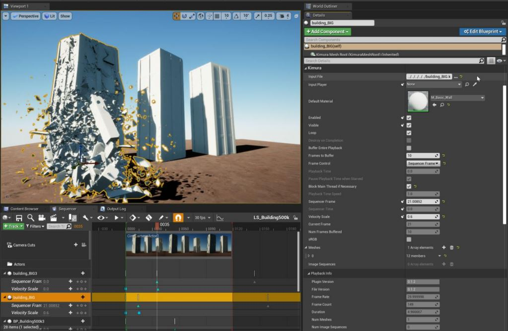
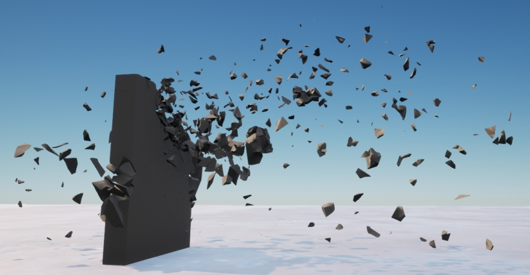
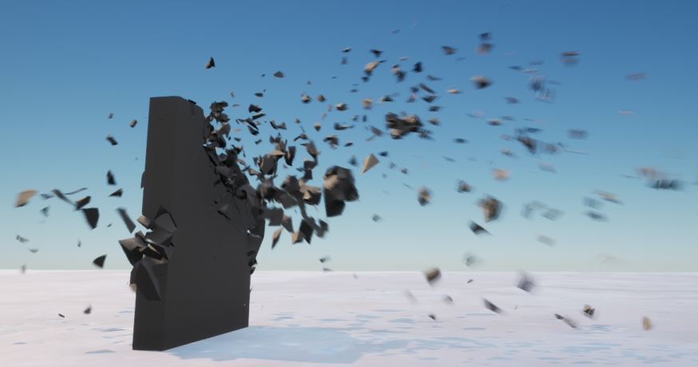
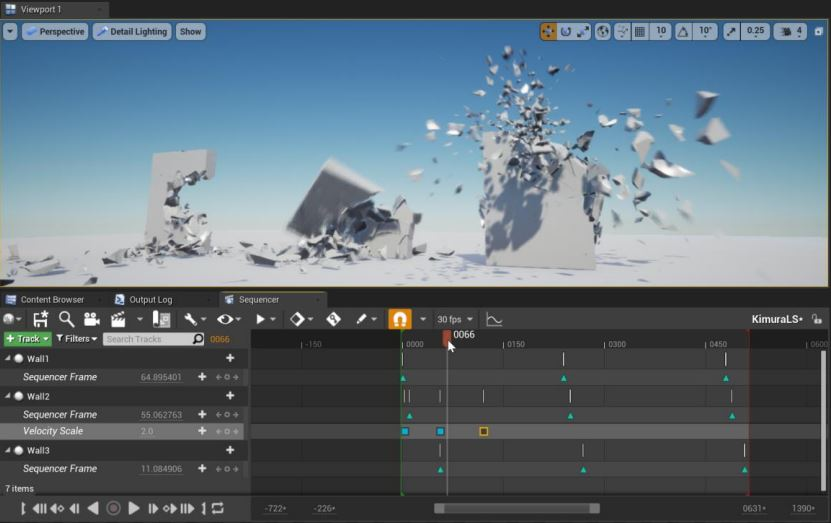
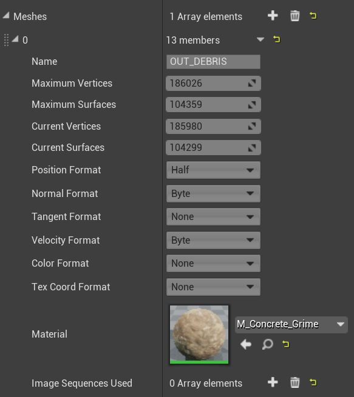
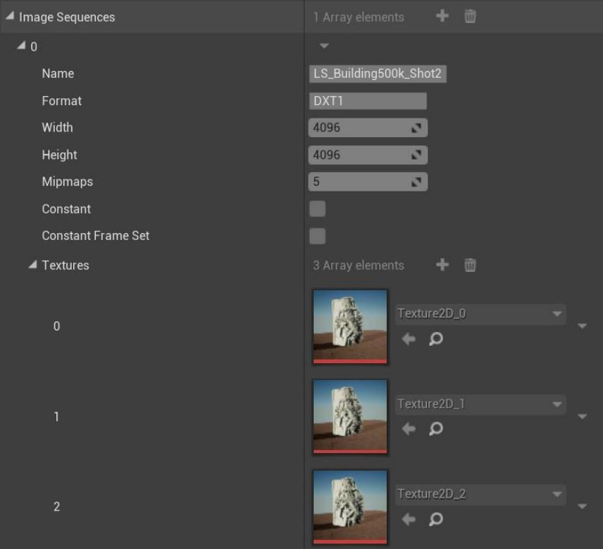
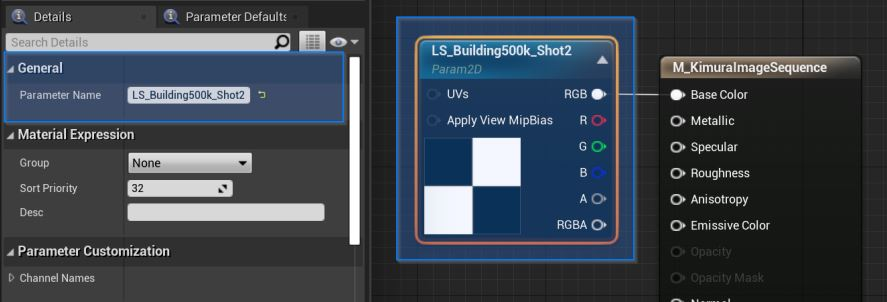
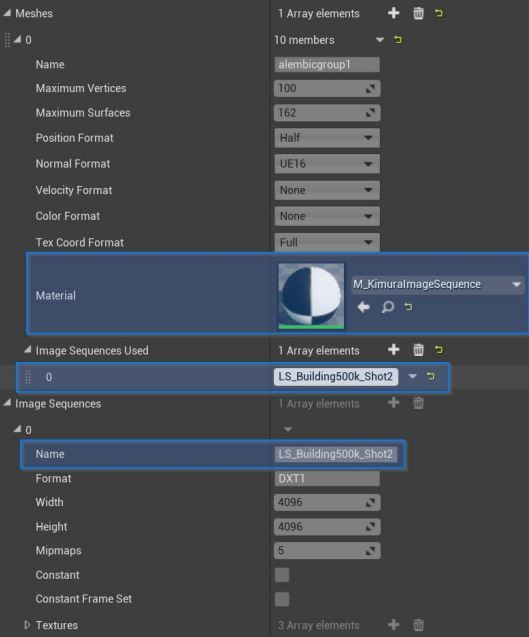

# Kimura Player for Unreal Engine

by Alexandre Hetu (alex@KimuraPlayer.com).

https://www.KimuraPlayer.com

Version 0.5.0

  
# Overview
The goal of Kimura is to provide playback of complex, animated scenes created in digital content creation tools such as Maya, Houdini, Cinema4D, 3dsmax, etc, in real-time rendering engines like Unreal Engine and Unity. It was developed so that creatives from the VFX industry can see, iterate, and experiment with their creations in real-time game engines. 

## Alembic content
As a starting point, Kimura makes uses of the Alembic file format (.abc). Most people from the VFX industry will know of this format already (visit www.Alembic.io for a detailed description). The Alembic format is great at providing baked geometry data for animated scenes, regardless of the authoring tool used to generate them. The drawback is that it is not optimal for playback in real-time. It is also limited to geometry data. Kimura uses its own file format (.k) and a conversion process from Alembic is necessary. 

Using a custom format allows us to:
- Store only the vertex data needed for rendering. 
- Store it as efficiently as possible so that it may be read and processed rapidly. 
- Store additional types of data, like animated textures.

## Image sequences
In addition to the mesh data, Kimura can store images (or textures) for every frame of an animation. Up to 16 image sequences can be stored per Kimura file. 

## The result: 
Animations that aren’t limited by static mesh topology or by single sets of textures, two limitations often found in real-time game engine nowadays. This means that vertex positions, normals, tangents, texture coordinates, colors and textures can be changed at every single frame of an animation. The format is essentially a flipbook of meshes and textures that can be accessed and put together very rapidly by the Kimura Player. 

  
# Standalone libraries
This project uses standalong libraries of the Kimura Player. Standalone libraries of Kimura Player and its conversion tool (AbcToKimura) can be found and built from a separate depot: [KimuraPlayer](https://github.com/ahetu04/KimuraPlayer)

  
# Installation
This plugin comes with sources and must be compiled. Copy this plugin in either the Project or Engine's Plugins directory, re-generate the solution and recompile. 

> Note: Installing the plugin will force all shaders and materials to recompile. 
## Modules
The Kimura plugin comes with two modules that match the standalone Kimura code libraries.

* ``Kimura`` A player capable of reading Kimura files and giving frame data to any real-time rendering engines. Provides everything needed for playback of Kimura content through a AKimuraPlayer actor instance. AKimuraPlayer instances can tick in both editor and play-in-editor. Kimura Player's source files are actually included in this module and compiled through Unreal's build process. 
* ``KimuraConverter`` (Win64 only) Wraps around the KimuraConverter library to provide an in-editor tool for converting alembic(.abc) files to Kimura (.k).

## Plugin content
The plugin comes with a blueprint and a few materials useful for testing Kimura assets. To enable plugin content in the content browser, select ‘View Options’ and enable ‘Show Plugin Content’.

  
# TLDR; Convert and play alembic content  in the editor
If you want to get the best out of the plugin, reading the rest of this document is obviously highly 
recommended. 
But if you just want to try it out here’s how to do it.
* Convert an alembic file (.abc) to Kimura (.k)
    * Open the abcToKimura tool
    * Set the input file to point to a valid alembic file (.abc) and the output file point to an accessible location. 
    * The alembic file must contain triangulated poly meshes. See Prerequisites for alembic files for more info.
    * Press ‘Convert’.
* Enable viewport ticking (real time rendering in the viewport).
* From the Kimura plugin’s content folder, find the blueprint ‘BP_KimuraPlayer’ and drag it into the scene.
* Select the new KimuraPlayer actor instance. In its Input File, pick the .k file generated by the first step.
* Toggle the actor's 'Enable' property ON.
* If no ‘Default material’ is set on the actor, playback will not start. Set any material you like but make sure that the original alembic document provides the necessary vertex elements required by that material (for example, texture mapping requires texture coordinates).
* If no content seems to appear, consider the scale used when converting the alembic document. Unreal uses centimeters and the asset might just be very small.
  

# Viewport ticking
Kimura player actors can tick in the editor viewport, even when not in PIE mode. This allows for immediate preview of content, changes, materials, and sequencer keys. Realtime rendering must be enabled in the viewport for viewport ticking to work. Make sure you enable ‘Realtime’ in the Viewport options.

  

# Kimura Player actor details
The Kimura player actor has many properties, some of which can be edited to control how the content should be buffered and played. Some are only editable under certain conditions; for example, ‘Frames to Buffer’ will not be used if ‘Buffer Entire Playback’ is set. Additional sub-categories can be expanded to display playback and profiling information. Additional descriptions of the properties can be obtained by moving the mouse cursor over each of the property names.

  

# Import/Assets
Kimura files don’t require to be imported by Unreal. They should be treated as movies and such. For compatibility, Kimura files should be converted and played by the same version of the library it is running on. Files that are incompatible with a version of the plugin will simply be ignored by the player.
  

# Velocity rendering
Also known as motion blur. Velocity rendering is a great feature of Unreal Engine and is fully supported by the Kimura player. There are requirements for velocity rendering to work correctly:
* The converted alembic file must contain velocity data.
* The project’s settings must have the option `Output velocity during base pass` enabled.
* If previewing in the editor’s viewport (not in ‘Play’ mode), the viewport UI must be hidden. Toolbar -> Settings -> Hide viewport UI. Or toggle it by pressing ‘G’ when the viewport is selected. 

> Keep in mind that some project templates do not enable velocity rendering by default (ex: Film, Live events projects).

You can diminish or exaggerate the amount of velocity applied on a single actor by modifying its ‘Velocity Scale’ property. This can be done from both the details panel and from the sequencer (see ‘Sequencer’). 

  

# Sequencer

The Kimura player actor was designed with Unreal’s sequencer in mind, and more specifically with the ability to preview directly in the editor. The sequencer can be used for controlling the following properties:
* `Enabled`: When a player should be buffering data and playing.
* `Visible`: When a player should be visible.
* `SequencerTime` and SequencerFrame: The current frame to be displayed. 
* `VelocityScale`: The amount of velocity to render at any moment. 

To control playback position from the sequencer, you must first set the `Frame Control` property to either `Sequencer Time` or `Sequencer Frame`. Some properties will then become accessible based on the method used. Then, from a level sequence, add a reference to a Kimura player actor and add tracks and keys for either its ‘SequencerFrame’ or ‘SequencerTime’

## Reverse playback
By default, the Kimura player expects to play content forward and is always working to read frames ahead of the current playback position. It also discards frames that are behind it. Playing content backward is therefore not optimal because doing so is constantly resetting the buffering process. 

But reverse playback is still possible! If you intend to play in reverse or need to perform a lot of scrubbing (back and forth on the sequencer track), you should consider enabling ‘Buffer Entire Playback’ on the actor. This will effectively load all the frames in memory so you might have to be careful with budgeting the memory requirements.
  

# Meshes
Kimura files may contain multiple meshes. The Kimura player will create an individual mesh component
for each one of them. For each mesh component you can control the material assigned to it, whereas each mesh instance will have its own material instance. When no material interface is specified on a mesh, the actor’s Default Material property will be used to create that instance. 

> A material must be set on the ‘Default Material’ property for the playback to start, regardless of whether it is used by mesh instances or not.

Once a .k file is set on an actor, its ‘Meshes’ property will be populated and you will be able to edit the materials and image sequences assigned to each mesh. These properties will be saved along the scene and/or blueprint. They will also be updated in situations where the .k file changes.

  
# Image sequences
Among the properties displayed on actor instances, you’ll also find information for each of the image sequences stored in the Kimura file. The ‘Name’ property contains the name that should be used for binding image sequences to meshes and materials (see below)

## Binding image sequences onto mesh instances

Binding textures from image sequences to the material instances on meshes is done in two stages. 

First, in the material to be assigned to a mesh, a Param2D node with the name of the image sequence must be present.

Second, in the mesh’s properties, the name of the image sequence must be listed in its “Image Sequences Used” property.

Once the names are properly set, the Kimura player actor will automatically perform the necessary binding operations between the textures coming from image sequences and the material instances bound to the meshes. The textures data can be used for anything. The current limit is 16 textures per frame (16 image sequences per Kimura file).

  
# Instancing
By default, every Kimura player actor has its own file handle to a .k file and stores its own copies of frame data in memory. This means that if you create two instances of Kimura player actors pointing to the same Kimura file, they will duplicate a lot of data.

But there is a way to avoid this duplication of data. Rather than specifying an `Input File`, a Kimura player actor can instead specify another actor as its input source (property `Input Player`). The only requirement is that the Kimura player used as a source buffers the entire playback (has its property `Buffer Entire Playback` checked).

  
# Pre-requisites for Alembic files (.abc)

* The meshes must be triangulated. Try reducing the vertices and surfaces counts if possible. 
* Frames must be indexed at 0 and higher. 
* Try keeping number of meshes low; merge poly meshes where possible before exporting to alembic. If you run simulations where complex objects are broken up into thousands of pieces, be careful to not export them as separate meshes. 
* Position information must be present. Normals, tangents, velocity, colors, texture coordinates and textures are optional. 

  
# AbcToKimura command-line tool

The abcToKimura.exe command line tool converts geometry data from an Alembic file (.abc), and may combine it with textures coming from image sequences, to produce a Kimura file (.k). 

You’ll find the executable under the plugin’s ‘CmdLineTool’ directory. 

The default conversion options will work for playback in Unreal. The simplest command requires only specifying input and output files:
- Open a Command Prompt from the Start Menu (type ‘cmd’).
- Go to the folder containing AbcToKimura.exe (type “cd {PathToExe}). You can also add the path to your environment paths if you wish to use the tool from anywhere. 
- Run the following command: AbcToKimura.exe i:input.abc o:output.k
    - Whereas ‘i:’ specifies a parameter to specify the input file; ‘input.abc’ is a full or relative path to an .abc file; ‘o:’ is a param for ‘output’; and ‘output.k’ is also a full or relative path. 

## Options
- `scale`: Scales the meshes’ positions. Default is ‘1.0’.
- `start`: Frame index at which the converter will start converting frames. Default is 0.
- `end`: Frame index at which the converter will stop converting frames. Default is 9999999.
- `split`: Split and optimize meshes to force use of 16bit index buffers. Default is 'true'.
- `swizzle`: Swizzles components of the position and normal elements of the meshes. Can be 
‘none’, ‘yz’ and ‘xz’. Default is ‘none’
- `flip`: Flips the order of triangle indices. Default is ‘none’.
- `flipUV`: Flips the V component of the texture coordinates. Can be ‘true’ or ‘false’. Default is 
‘true’. 
- `pFmt`: Format in which positions are saved. Can be ‘full’, ‘half’. Default is ‘full’.
- `nFmt`: Format in which normals are saved. Can be ‘full’, ‘half’, ‘byte’, and ‘none’. Default is ‘ue16’.
- `ntFmt`: ntFmt: Format in which normals tangent are saved. Requires normals and texture coordinates to be present. Can be 'full', 'half', 'byte' and 'none'. Default is 'half'.
- `vFmt`: Format in which velocities are saved. Can be ‘full’, ‘half’, ‘byte’ and ‘none’. Default is ‘byte’.
- `tFmt`: Format in which texture coordinates are saved. Can be ‘full’, ‘half’ and ‘none’. Default is ‘full’.
- `cFmt`: Format in which colors are saved. Can be ‘full’, ‘half’ and ‘bytehdr’ and ‘byte’. Default is ‘byte’.
- `cpu`: Number of threads used for processing frames. By default, this is automatically set to the number of cores available. 
    > *NOTE*: Very large frames (100MB+) may require a lot of memory to process. If you find yourself in a situation where converting an alembic file is very long due to memory swap (not enough RAM on the system), reducing the number of concurrent threads will help. 

## Image sequence options
Besides mesh data, individual frames may also contain images. This way, entire sequences of images can be converted and mapped along the frames. 

The simplest option to add image sequences from the conversion tool is “image[index]”:
> abcToKimura.exe i:input.abc o:output.k image0:./first-sequence/image-0001.png
> abcToKimura.exe i:input.abc o:output.k image1:./second-sequence/image-0001.png

By default, the conversion tool will convert images in the DXT1 format, generate mipmaps and keep the original size up to 8192x8192.

> NOTE: the converter will automatically try to adjust downward the width and height of textures to power of two sizes. A 1920x960 will be reduced to a 1024x512, and so on. Certain types of files are known to not work well with the converter; for instance, square PNG files will work but non-square PNG file will not.

The following command line options can be passed to AbcToKimura to process image sequences:

- `image[index]`: Path to the first image of a sequence. The converter will automatically find and sort all images in the folder. Each sequence should have its own folder with nothing else in it but the images. 
- `image[index]mips`: Whether to generate mipmaps for each image in the sequence. Default is ‘true’.
- `image[index]size`: The maximum size (width and height) of an image. Must be a multiple of 2. Default is 8192.
- `image[index]fmt`: Image format to convert the image to. Default is DXT1. The ‘index’ specifies which image sequence the options are for. There can be up to 16 image sequences stored in one Kimura file. 

## Examples:
- abcToKimura.exe i:fromHoudini.abc o:ToKimura.k
- abcToKimura.exe i:inputFile.abc o:outputFile.k scale:0.1 start:10 end:240 swizzle:yz flip:true flipUV:true nFmt:none tFmt:none
- abcToKimura.exe i:inputFile.abc o:outputFile.k scale:100 swizzle:yz flip:true flipUV:true pFmt:half vFmt:byte nFmt:ue16 tFmt:half
- abcToKimura.exe i:input.abc o:output.k image0:./seq0/image-0001.png image0mips:true image0size:1024 image0fmt:DXT1 image1:./single0/singleImage.png image1mips:false image1size:8192 image1fmt:DXT1

If the input and output files are valid, you should see the conversion process listing information about each of the converted frames, followed by a success message.

## AbcToKimura from the Unreal editor
The conversion tool is also available from Unreal editor. Under the ‘Window’ menu you will find the option ‘abcToKimura’ under the Kimura Player section. 

  
# Performance and optimizations
The process of playing alembic content in real-time ultimately comes down to reading and moving data as fast and as efficiently as possible. Alembic frames don’t have any limitations in terms of meshes and geometry density, and adding textures to individual frames can increase the size of a Kimura file considerably. The two main factors that should be considered when looking at performance are: how much data goes in each frame, and how fast the hardware is at processing that data. More complex and heavier animation frames require more machine power, it’s that simple. On the hardware side, there are 3 types of bottlenecks that can impact performance:

## Disk speed
How fast can the system read frame data from the disk. If it takes longer to read a frame from the disk than the time allowed to present it, the player will likely run out of frames to present and stutter. For example, an animation averaging 10MBs per frame, providing 60 frames per second, will require a read speed of at least 600MBs of data per second. Newer models of NVMe SSDs won’t sweat over that number but older generations of SSDs might. A solution to work around the disk speed problem is to give enough time for the player to buffer more frames ahead of time, or even buffer the entire animation in memory.

## Memory and CPU 
How fast can frame data be copied in GPU memory. Faster CPU cores and memory will do better. Keep in mind that a Kimura frame might get updated well under the time necessary to display a frame but still impact the overall time needed for a game engine to prepare the rest of that frame. 

## Rendering speed - GPU
How fast the graphics card is at processing geometry buffers and outputing pixels. Here, Kimura meshes can be optimized like any other types of graphical assets (static meshes with less triangles, textures smaller in resolution, etc). Screen resolution, anti-aliasing, pixel overdraw, lighting and shadow passes, velocity rendering, stereoscopy and post-processing effects are all important factors as well. The Kimura player manages to do well with very large animations, however the definition of "large" can differ from one person to another. If you keep on growing the complexity and size of an animation, you will eventually reach a point where the hardware will not be able to digest it fast enough for real-time playback. In any case, it should be sufficiently fast and responsive for previewing in an editor and for generating high quality renders.

## Vertex components and formats
Reducing the data size of each frame will automatically lead to performance gains, and the converter and player are quite good at offering ways to do just that. Most vertex components can be serialized in different formats, each with different levels of compression. And if a vertex component is not required, it can be discarded completely. For example, a small dimension object using a material requiring very simply lighting might only require 16-bit positions and 8-bit normals, and nothing else. Optimal formats can be used to maximize performance specifically for your needs. 

### Position
- `full`: 32-bit, full precision. Takes 12 bytes per vertex. 
- `half`: 16-bit, less precision. Works well for meshes under a certain dimension. Takes 6 bytes per vertex. 

### Normal
- `full`: 32-bit, full precision. Takes 12 bytes per vertex. Rarely necessary.
- `half`: 16-bit, high precision. Takes 6 bytes per vertex. Precise enough for most cases. 
- `byte`: 8-bit, less precision. Only takes 3 bytes per vertex but can be noticeable. 
- `none`: Normals discarded. 

### Tangent
- `full`: 32-bit, full precision. Takes 16 bytes per vertex. Rarely necessary.
- `half`: 16-bit, decent precision. Takes 8 bytes per vertex. Precise enough for most cases. 
- `byte`: 8-bit, less precision. Only takes 4 bytes per vertex but can be noticeable. 
- `none`: Tangents discarded. 

### Velocity
- `full`: 32-bit, full precision. Takes 12 bytes per vertex. Rarely necessary.
- `half`: 16-bit, high precision. Takes 6 bytes per vertex. Highly precise.
- `byte`: 8-bit, decent/high precision. Only takes 3 bytes per vertex. Difference between the formats is hardly noticeable, therefore selecting `byte` is usually the best option.
- `none`: Velocity discarded. 

### Texture coordinate
- `full`: 32-bit, full-precision. Takes 8 bytes per UV channel, per vertex. Allows texture coords below 0.0 and over 1.0. 
- `half`: 16-bit, decent prevision. Takes 4 bytes per UV channel, per vertex. Texture coords must be in the range of 0.0 and 1.0.
- `none`: Texture coordinates discarded. 

### Color
- `full`: 32-bit, HDR, full-precision. Takes 16 bytes per vertex, per color channel. Overkill for colors, but could be used for storing arbitrary data. 
- `half`: 16-bit, HDR, decent precision. Takes 8 bytes per vertex, per color channel. High-quality HDR. 
- `bytehdr`: 8-bit, HDR, low precision. Takes 4 bytes per vertex, per color channel. Allows saving colors with values over 1.0 but the precision loss might be noticeable depending on the content. 
- `byte`: 8-bit, 256 possible values per channel. Takes 4 bytes per vertex, per color channel. 
- `none`: Colors discarded. 

## Unreal Insight support
Both the standalone and the plugin code contain various markers that will help trace when and how much time is spent on reading frame data and copying it from the render thread. It is particularly useful for comparing the gains made by either removing or compressing specific vertex components.